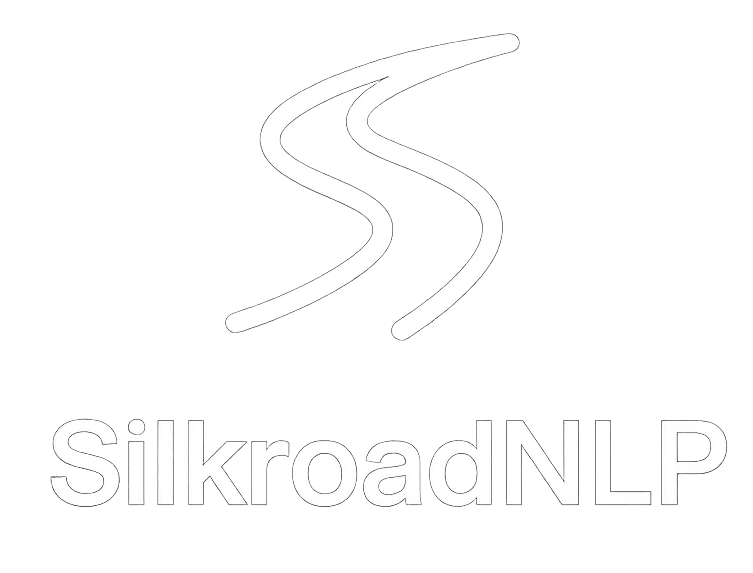
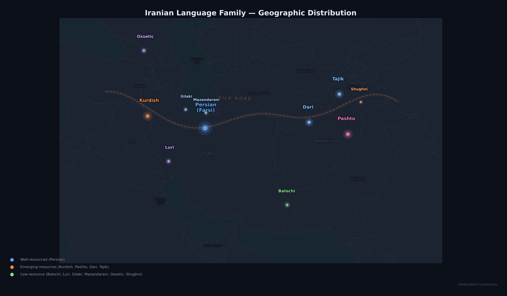

  

<h1 align="center">Awesome SilkRoadNLP </h1>

  A curated collection of NLP and LLM resources for the <strong>Iranian language family</strong> 
  Maintained by the <a href="https://www.silkroadnlp.org/">SilkRoadNLP</a> community

---

## About SilkRoadNLP

**SilkRoadNLP** is a community dedicated to advancing computational research and responsible AI for the Iranian linguistic family — a richly diverse group of languages spanning Iran, Afghanistan, Central and South Asia, and the Caucasus. The community provides a collaborative platform for scholars, engineers, and community researchers to explore the linguistic, historical, and social dimensions of NLP for Iranian languages.

The Iranian language family represents one of the most linguistically diverse groups within the Indo-European family. While **Persian (Farsi)** serves as the official language of Iran with over 70 million speakers, the family includes numerous other significant languages such as **Kurdish** (~30 million speakers), **Pashto** (co-official language of Afghanistan), and regional languages like **Dari**, **Tajik**, **Balochi**, **Gilaki**, **Mazandarani**, **Luri**, **Ossetic**, **Shughni**, and many related varieties.

Despite their cultural and linguistic importance, most Iranian languages remain severely under-resourced in terms of computational linguistics tools and datasets. SilkRoadNLP aims to bridge this gap by connecting linguists, language specialists, NLP practitioners, and Iranologists to advance Iranian-language NLP through transparent, culturally informed, and ethical approaches to AI.

**Website:** [silkroadnlp.org](https://www.silkroadnlp.org/)
**GitHub:** [github.com/silkroadnlp](https://github.com/silkroadnlp)

  

### Key Focus Areas

- Dataset curation for low-resource Iranian languages
- Culturally-aware sentiment analysis and content moderation
- Machine translation across Iranian language varieties
- Automatic speech recognition for Iranian languages
- Reasoning and comprehension capabilities of LLMs on Iranian languages
- Script normalization for languages with diverse writing systems
- Lexical resources and treebanks

---

## Table of Contents

- [About SilkRoadNLP](#about-silkroadnlp)
- [Languages](#languages)
  - [Persian (Farsi)](#persian-farsi)
  - [Kurdish](#kurdish)
  - [Pashto](#pashto)
  - [Dari](#dari)
  - [Tajik](#tajik)
  - [Shughni](#shughni)
  - [Caspian Languages (Gilaki & Mazandarani)](#caspian-languages-gilaki--mazandarani)
  - [Other Iranian Languages](#other-iranian-languages)
- [Multilingual & Cross-lingual Resources](#multilingual--cross-lingual-resources)
- [SilkRoadNLP Workshop Papers](#silkroadnlp-workshop-papers)
- [Contributing](#contributing)

---

## Languages

### Persian (Farsi)

Persian has received the most attention among Iranian languages in computational linguistics research, with resources spanning language models, treebanks, hate speech detection, semantic similarity, machine translation, speech processing, and more.

**[View all Persian resources →](languages/persian.md)**

**Highlights:**
- **ParsBERT** — Monolingual BERT for Persian, SOTA on sentiment analysis, NER, and text classification
- **Phate** — 7,000+ annotated Persian tweets for multi-label hate speech detection
- **DivanBench** — Cultural and conceptual knowledge benchmark for Persian LLMs
- **PersianPunc** — 17M-sample dataset for punctuation restoration
- **PMWP** — 15,000 Persian math word problems

---

### Kurdish

Kurdish functions as a bi-standard language with the Sorani dialect (Arabic-based alphabet) and Kurmanji dialect (Latin-based alphabet), presenting unique computational challenges. Resources focus on WordNet development and script normalization.

**[View all Kurdish resources →](languages/kurdish.md)**

**Highlights:**
- **KurdNet** — First prototype of the Kurdish WordNet
- Script normalization tools for Sorani and Kurmanji dialects

---

### Pashto

Pashto, the co-official language of Afghanistan spoken by millions, has received some research attention but remains under-resourced compared to Persian. Recent work addresses offensive language detection.

**[View all Pashto resources →](languages/pashto.md)**

**Highlights:**
- Benchmarking offensive language detection across Persian and Pashto

---

### Dari

Dari, spoken in Afghanistan, is closely related to Persian but uses different writing conventions and has regional variations. Computational linguistics work for Dari remains extremely limited.

**[View all Dari resources →](languages/dari.md)**

**Highlights:**
- Evaluating multilingual LLMs across Persian, Dari, and Tajik varieties

---

### Tajik

Tajik, used in Tajikistan, presents particular computational challenges due to its multi-script nature — written in both Cyrillic and Arabic scripts, complicating unified NLP tool development.

**[View all Tajik resources →](languages/tajik.md)**

**Highlights:**
- **TajPersLexon** — 40,112-entry Tajik-Persian bilingual lexical resource
- Cross-script NLP bridging Cyrillic and Perso-Arabic

---

### Shughni

Shughni is an endangered Iranian language of the Pamirs with fewer than 100,000 speakers and extremely limited digital resources. Recent work has produced the first machine translation systems for this language.

**[View all Shughni resources →](languages/shughni.md)**

**Highlights:**
- First MT system for Shughni using donor language enhancement

---

### Caspian Languages (Gilaki & Mazandarani)

Gilaki and Mazandarani are Caspian Sea regional languages each with over 2 million speakers, but computational resources remain extremely limited. Recent work focuses on script normalization for their Perso-Arabic writing systems.

**[View all Caspian language resources →](languages/caspian.md)**

---

### Other Iranian Languages

Several other Iranian languages — including **Balochi**, **Luri**, **Ossetic**, **Gorani**, **Kashmiri**, and **Sindhi** — remain largely absent from computational linguistics research due to insufficient data availability. This section tracks emerging work.

**[View all other language resources →](languages/other.md)**

---

## Multilingual & Cross-lingual Resources

Resources spanning multiple Iranian languages or bridging them with other world languages.

**[View all multilingual resources →](languages/multilingual.md)**

**Highlights:**
- **APARSIN** — Multi-variety sentiment and translation benchmark for 14 Iranic languages
- **JW300** — Wide-coverage parallel corpus covering 300+ languages including Iranian varieties
- Cross-lingual semantic similarity datasets (Persian, English, Spanish, French, German, Portuguese)

---

## SilkRoadNLP Workshop Papers

The SilkRoadNLP community organizes workshops co-located with major NLP conferences. The proceedings of the first workshop (2026) are available:

- **Proceedings:** [ACL Anthology](https://aclanthology.org/volumes/2026.silkroadnlp-1/)
- **Papers Repository:** [EACL 2026 SilkRoadNLP Proceedings](https://github.com/SilkRoadNLP/SilkRoadNLP-Workshop-Papers-2026)

---

## Contributing

We welcome contributions! If you know of a resource, dataset, tool, or paper related to NLP for Iranian languages that is not listed here, please:

1. Fork this repository
2. Add your resource to the appropriate language page under `languages/`
3. Submit a pull request

For each entry, please include:
- Paper title and authors
- Link to the paper (preferably ACL Anthology, arXiv, or publisher DOI)
- Link to code repository (GitHub, GitLab, etc.) if available
- Link to models/datasets on HuggingFace if available

---

## License

This list is released into the public domain under CC0 1.0.
